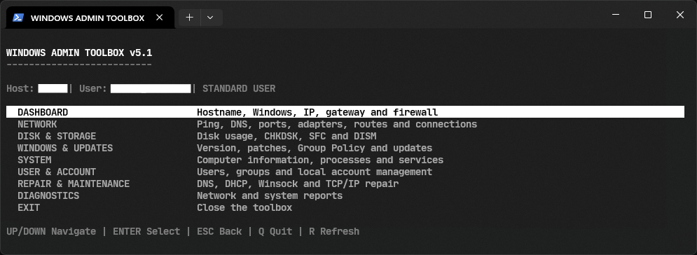
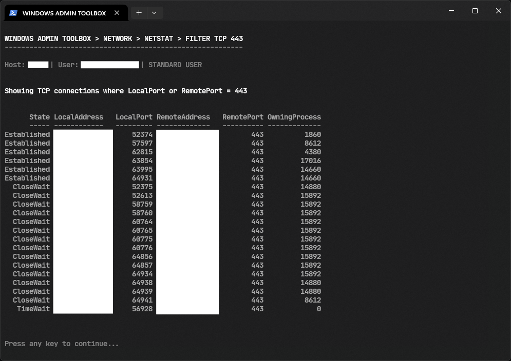
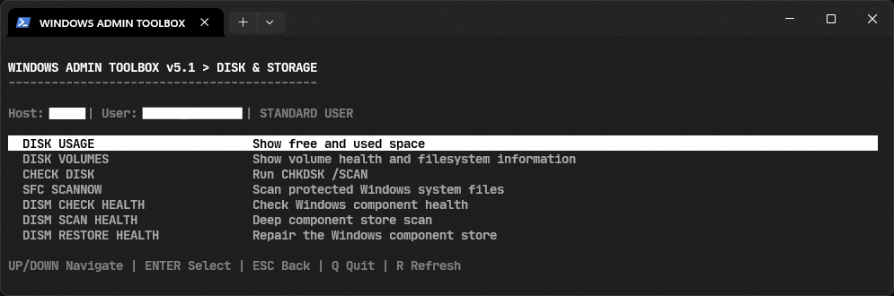
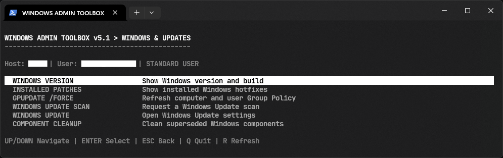
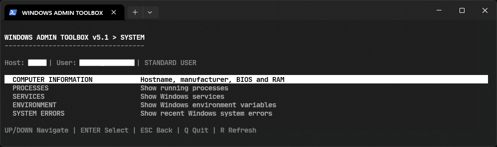
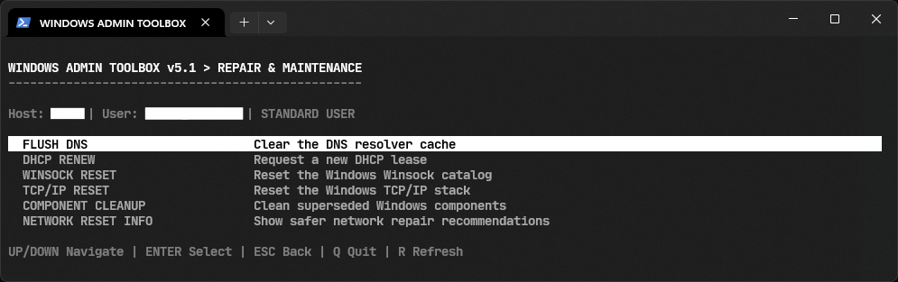
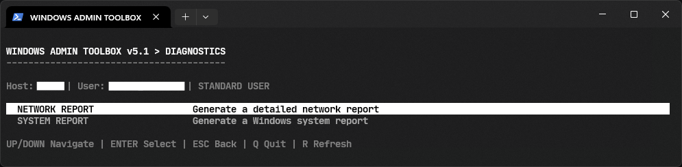

# Windows Admin Toolbox

A PowerShell-based terminal user interface for common Windows administration, diagnostics, networking, system information, user management, and repair tasks.



<h2>Requirements</h2>

<table>
<tr>

<td align="center">


<br>

Windows 10 or later

</td>

<td align="center">


<br>

PowerShell 5.1 or later

</td>

<td align="center">


<br>

Administrator privileges

</td>

</tr>
</table>

## Features

### Dashboard

Displays:

* Hostname
* Current username
* Domain
* Computer manufacturer and model
* Windows version and build
* Architecture
* Last boot time
* System uptime
* IPv4 address
* Default gateway
* DNS servers
* Firewall status
* Current privilege level


### Network

Provides tools for:

* Ping and packet-loss testing
* Traceroute
* DNS lookup
* Reverse DNS lookup
* TCP port testing
* Network adapter information
* IPv4 and IPv6 addresses
* Routing table inspection
* ARP and network neighbor information
* TCP and UDP connection inspection through Netstat


The Netstat interface also supports filtering connections by port and refreshing results.




### Disk and Storage

Provides:

* Disk usage information
* Volume and filesystem information
* CHKDSK `/SCAN`
* SFC `/SCANNOW`
* DISM `CheckHealth`
* DISM `ScanHealth`
* DISM `RestoreHealth`



Administrative privileges are required for CHKDSK, SFC, and DISM operations.

### Windows and Updates

Provides:

* Windows version and build information
* Installed Windows hotfixes
* `GPUPDATE /FORCE`
* Windows Update scan
* Windows Update settings shortcut
* Windows component cleanup



### System

Provides:

* Computer and BIOS information
* RAM information
* Running processes
* Windows services
* Environment variables
* Recent System event log errors



### User and Account

Provides:

* Current Windows identity
* Local user enumeration
* Local group enumeration
* Local user renaming


Renaming a local user requires administrator privileges.

### Repair and Maintenance

Provides common network repair operations:

* Flush DNS cache
* Renew DHCP lease
* Reset Winsock
* Reset TCP/IP
* Network reset recommendations



Operations that can affect network connectivity require confirmation before execution.

### Diagnostics

Generates:

* Network reports
* System reports



Network reports are saved to the current user's Desktop as:

```text
NetworkReport_YYYYMMDD_HHMMSS.txt
```

System reports are saved as:

```text
SystemReport_YYYYMMDD_HHMMSS.txt
```

## Controls

| Key       | Action         |
| --------- | -------------- |
| Up / Down | Navigate menus |
| Enter     | Select         |
| Esc       | Go back        |
| Q         | Quit           |
| R         | Refresh        |
| Backspace | Delete input   |

## Installation

Clone or download the project and place the PowerShell script in a convenient directory.

Example:

```powershell
git clone https://github.com/pipeline-voyager/junk.git

cd junk/Windows_Admin_Tools/
```

No additional PowerShell modules or external dependencies are required beyond the Windows components used by the toolbox.

## Running

Open PowerShell and execute:

```powershell
.\WindowsAdminToolbox.ps1
```

For full functionality, start PowerShell as Administrator before running the script.

If PowerShell's execution policy prevents the script from running, review the current policy with:

```powershell
Get-ExecutionPolicy
```

Do not change the execution policy globally unless it is appropriate for your environment.

## Administrator Privileges

The toolbox can run as a standard user, but several operations require an elevated PowerShell session.

Administrator privileges are required for operations such as:

* CHKDSK
* SFC
* DISM
* Windows Update scanning
* Component cleanup
* Local user management
* DNS flushing
* DHCP renewal
* Winsock reset
* TCP/IP reset

The application detects whether it is running with administrator privileges and displays the current privilege level in the interface.

## Safety

This tool executes Windows administrative commands and system configuration operations.

Review an operation before executing it, especially:

* SFC
* DISM RestoreHealth
* CHKDSK
* User account changes
* Winsock reset
* TCP/IP reset
* DHCP renewal
* Component cleanup

Some operations can temporarily interrupt network connectivity or modify system configuration.

The toolbox does not automatically perform a complete Windows network reset because doing so can remove or modify network adapter configuration.

## Author

Carl Lazaro

`@pipeline-voyager`

## Version

Version 5.1